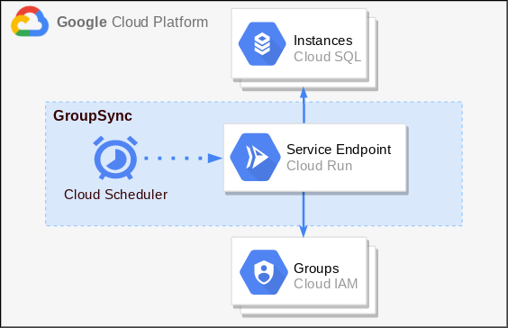
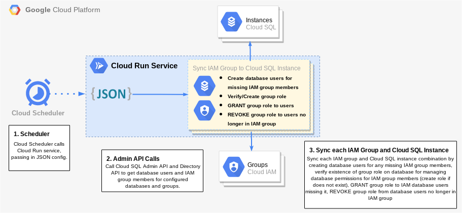
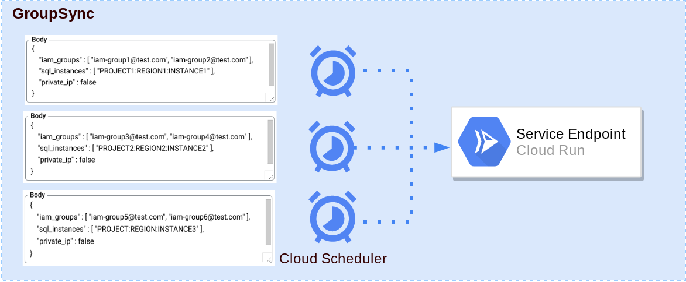
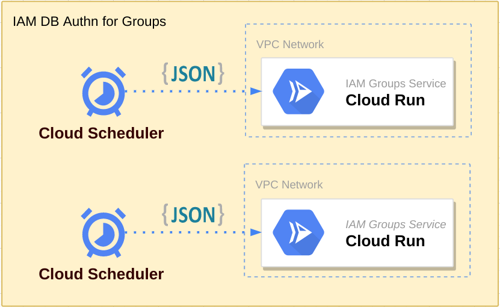

# GroupSync: Cloud SQL IAM Database Authentication for Groups
**Note:** This project is experimental and is not an officially supported Google product.

GroupSync is a self-deployed service that provides support for managing [Cloud SQL IAM Database Authentication](https://cloud.google.com/sql/docs/mysql/authentication) for groups. GroupSync leverages [Cloud Run](https://cloud.google.com/run), [Cloud Scheduler](https://cloud.google.com/scheduler), and the [Cloud SQL Python Connector](https://github.com/googlecloudplatform/cloud-sql-python-connector) to consistently update and sync Cloud SQL instances based on IAM groups. It will create missing database IAM users, GRANT roles to database IAM users based on their IAM groups, and REVOKE roles from database IAM users no longer in IAM groups.

## Supported Databases
Currently only the following databases are supported:
- **MySQL 8.0**
- **PostgreSQL 13, 12, 11, 10, 9.6**

## Overview
The GroupSync service at an overview is made of Cloud Scheduler Job(s) and Cloud Run instance(s).

The Cloud Scheduler Job(s) are configured to run on the interval of your choosing (every 10 mins, 1 hour, daily etc.) When ran, the Cloud Scheduler calls a GroupSync Cloud Run service, passing in the configured request body from the scheduler, which contains parameters that tell the service which IAM groups and which Cloud SQL instances to sync and manage.

<p align="center"></p>

The Cloud Run service calls the required Google APIs to get a snapshot of the current IAM group(s) members and the current Cloud SQL instance(s) database users, it then adds any new IAM members who have been added to the IAM group since the last sync as an IAM database user on the corresponding Cloud SQL instances. The Cloud Run service then also verifies or creates a database role within each configured database for each configured IAM group. Mapping each IAM group to a database role, the service can then GRANT/REVOKE this group role with the appropriate database permissions for the IAM group to all the proper IAM database users who are missing it or should not have it based on the members of the IAM group.

<p align="center"></p>

## Deployment
There are a few initial setups steps to get the GroupSync service ready and grant it the permissions needed in order to successfully operate. However, after this setup is complete, minimal configuration is needed in the future.

### Installation
To run this service successfully, please clone this repository to an environment that thas the Google Cloud SDK installed and initialized. [(Install and initialize the Cloud SDK)](https://cloud.google.com/sdk/docs/install)

```
git clone https://github.com/GoogleCloudPlatform/cloud-sql-iam-db-authn-groups
```

Step into the code directory.

```
cd cloud-sql-iam-db-authn-groups
```

Make sure the desired Google Cloud project is set. ([Creating a project](https://cloud.google.com/resource-manager/docs/creating-managing-projects))

Replace the following values:
- `PROJECT_ID`: The Google Cloud project ID.
```
gcloud config set project <PROJECT_ID>
```

### Enabling APIs
GroupSync requires enabling the following Cloud APIs for a successful deployment and lifecycle.
 - [Cloud Run API](https://console.cloud.google.com/apis/api/run.googleapis.com/overview)
 - [Cloud Scheduler API](https://console.cloud.google.com/apis/api/cloudscheduler.googleapis.com/overview)
 - [Cloud Build API](https://console.cloud.google.com/apis/api/cloudbuild.googleapis.com/overview)
 - [Cloud SQL Admin API](https://console.cloud.google.com/apis/api/sqladmin.googleapis.com/overview)
 - [Admin SDK API](https://console.cloud.google.com/apis/api/admin.googleapis.com/overview)
 - [IAM Service Account Credentials API](https://console.cloud.google.com/apis/api/iamcredentials.googleapis.com/overview)

 **Note:** If planning to use GroupSync with a Cloud SQL instance that has a Private IP, the following additional APIs need to be enabled.
 - [Serverless VPC Access API](https://console.cloud.google.com/apis/api/vpcaccess.googleapis.com)
 - [Service Networking API](https://console.cloud.google.com/apis/api/servicenetworking.googleapis.com/overview)

 The above APIs and Services can be manually enabled through [APIs and Services](https://console.cloud.google.com/apis/dashboard) in the cloud console or enabled all at once by running one of the below commands.

 Enable APIs for use during the service:

 ```
 gcloud services enable run.googleapis.com cloudscheduler.googleapis.com cloudbuild.googleapis.com sqladmin.googleapis.com admin.googleapis.com iamcredentials.googleapis.com
 ```

 Enable additional APIs if service needs connections to **Private IP** Cloud SQL instances:

 ```
 gcloud services enable vpcaccess.googleapis.com servicenetworking.googleapis.com
 ```

### Creating the Service Account
A service account must be created and granted the proper IAM permissions in order for the GroupSync service to have appropriate credentials and permissions to access APIs, IAM groups and database users.

The following commands will create a service account and grant it the proper IAM roles and permissions for the GroupSync service to run successfully.

Replace the following values:
- `SERVICE_ACCOUNT_ID`: The ID (name) for the service account.
```
gcloud iam service-accounts create <SERVICE_ACCOUNT_ID> \
    --description="IAM Groups Authn Service Account" \
    --display-name="IAM Database Groups Authentication"
```

Grant new service account the following IAM roles and permissions.

Replace the following values:
- `SERVICE_ACCOUNT_ID`: The ID (name) for the service account.
- `PROJECT_ID`: The Google Cloud project ID.

Cloud Run invoker role for service account to invoke Cloud Run and make authenticated calls from Cloud Scheduler.
```
gcloud projects add-iam-policy-binding <PROJECT_ID> \
    --member="serviceAccount:<SERVICE_ACCOUNT_ID>@<PROJECT_ID>.iam.gserviceaccount.com" \
    --role="roles/run.invoker"
```

Create a custom IAM role with only permissions needed for service to run smoothly. Permissions include Cloud SQL permissions to access instances and database users, as well as a single IAM permission to generate proper OAuth2 credentials within service for accessing IAM group members.
```
gcloud iam roles create IamAuthnGroups \
    --project=<PROJECT_ID> \
    --title="IAM Groups Authn" \
    --description="Custom role for IAM DB Authn for Groups Service" \
    --permissions=cloudsql.instances.connect,cloudsql.instances.get,cloudsql.instances.login,cloudsql.users.create,cloudsql.users.list,iam.serviceAccounts.signBlob
```

Now grant the custom IAM role to the service account.
```
gcloud projects add-iam-policy-binding <PROJECT_ID> \
    --member="serviceAccount:<SERVICE_ACCOUNT_ID>@<PROJECT_ID>.iam.gserviceaccount.com" \
    --role="projects/<PROJECT_ID>/roles/IamAuthnGroups"
```

#### Assigning Group Administrator Role to Service Account
To properly allow read-access of an organization's IAM group members (i.e. which IAM users belong within a specific IAM group) within the GroupSync service, we need to assign the Google Workspace Group Administrator Role to the service account created above. This will allow the service account to properly call the [List Members Discovery API](https://developers.google.com/admin-sdk/directory/reference/rest/v1/members/list) to keep track of the IAM members being managed through this service.

To assign the Group Administator Role to the service account follow these four quick steps. ([How to Assign Group Administrator Role](https://cloud.google.com/identity/docs/how-to/setup#auth-no-dwd))

### Configuring IAM Groups
There is one step required for configuring IAM groups to be able to sync successfully with Cloud SQL instances. Each IAM group requires an IAM policy binding to allow it's IAM users to inherit the ability to connect and login to Cloud SQL instances when added as database users.

Add the required __Cloud SQL Instance User__ IAM policy binding through the following command or manually through the [Cloud Console](https://console.cloud.google.com/iam-admin/iam) by adding the __IAM group's email__ as the principal and selecting the __"Cloud SQL Instance User"__ role.

Replace the following values:
- `PROJECT_ID`: The Google Cloud project ID.
- `IAM_GROUP_EMAIL`: The email address associated with the IAM group.

```
gcloud projects add-iam-policy-binding <PROJECT_ID> \
    --member="group:<IAM_GROUP_EMAIL>" \
    --role="roles/cloudsql.instanceUser"
```

**NOTE**: The above command is required for each IAM group and the binding is added at the project level. Therefore, if an IAM group is being synced with Cloud SQL instances across several different projects, the command will need to be run for each project.

### Configuring Cloud SQL Instances
GroupSync requires Cloud SQL instances to be already created and to have the `cloudsql_iam_authentication` flag turned **On**. [(See how to enable flag here.)](https://cloud.google.com/sql/docs/mysql/create-edit-iam-instances)

#### Create a database user for service
To properly manage the database users on each Cloud SQL instance that is configured with GroupSync, the service needs to GRANT/REVOKE database users the proper role(s) corresponding to their IAM group(s). This is achieved by creating an IAM database authenticated service account user on each instance using the service account previously created. This will allow the service account to authenticate to the instance(s) while running the GroupSync service through the [Cloud SQL Python Connector](https://github.com/GoogleCloudPlatform/cloud-sql-python-connector).

Add the service account as an IAM authenticated database user on each Cloud SQL instance that needs managing through IAM groups. Can be done both manually through the Google Cloud Console or through the following `gcloud` command.

Replace the following values:
- `SERVICE_ACCOUNT_EMAIL`: The email address for the service account. (**NOTE**: For Postgres instances, remove the `.gserviceaccount.com` suffix from service account email.)
- `INSTANCE_NAME`: The name of a Cloud SQL instance.
```
gcloud sql users create <SERVICE_ACCOUNT_EMAIL> \
--instance=<INSTANCE_NAME> \
--type=cloud_iam_service_account
```

#### Granting Database Permissions to the Service Account's Database User
For GroupSync to run smoothly it needs the IAM service account database user to be granted several permissions on all Cloud SQL instances that the user was added to above. This allows for the GroupSync service to read usernames of other database users and GRANT/REVOKE the group role(s) appropriately.

Connect to all Cloud SQL instances in question with an admin user or another database user with appropriate permissions for the following commands. ([Connecting to an Instance](https://cloud.google.com/sql/docs/mysql/connect-overview))

Once connected, grant the service account IAM database user the following permissions:

#### MySQL Instance
Replace the following values in the below commands:
- `SERVICE_ACCOUNT_ID`: The ID (name) for the service account (everything before the **@** portion of email)
Allow the service account to read database users and their roles.
```
GRANT SELECT ON mysql.role_edges TO '<SERVICE_ACCOUNT_ID>';I
```

Allow the service account to **CREATE** group roles for IAM groups if they are missing.
```
GRANT CREATE ROLE ON *.* TO '<SERVICE_ACCOUNT_ID>';
```

Allow the service account to **GRANT/REVOKE** roles to users through being a **ROLE_ADMIN**.
```
GRANT ROLE_ADMIN ON *.* TO '<SERVICE_ACCOUNT_ID>';
```

#### PostgreSQL Instance
Postgres allows a role or user to easily be granted the appropriate permissions for **CREATE**, and **GRANT/REVOKE** that are needed for creating and managing the group roles for IAM groups with one single command.

Replace the following values:
- `SERVICE_ACCOUNT_EMAIL`: The email address for the service account with the `.gserviceaccount.com` suffix removed.
```
ALTER ROLE "<SERVICE_ACCOUNT_EMAIL>" WITH CREATEROLE;
```

## Deploying to Cloud Run
To build and deploy the service to Cloud Run, run the following commands:

Build the container image for the service using Cloud Build:

Replace the following values:
- `PROJECT_ID`: The Google Cloud project ID.
```
gcloud builds submit \
  --tag gcr.io/<PROJECT_ID>/iam-db-authn-groups \
  --project <PROJECT_ID>
```

Deploy Cloud Run Service from container image:

Replace the following values:
- `SERVICE_ACCOUNT_EMAIL`: The email address for the service account created above.
- `PROJECT_ID`: The Google Cloud project ID.
```
gcloud run deploy iam-db-authn-groups \
  --image gcr.io/<PROJECT_ID>/iam-db-authn-groups \
  --no-allow-unauthenticated \
  --service-account <SERVICE_ACCOUNT_EMAIL> \
  --project <PROJECT_ID>
```

You should now successfully have a Cloud Run service deployed under the name `iam-db-authn-groups`. The service URL should be outputted from the `gcloud` command above but can also be found in the [Cloud Console](https://console.cloud.google.com/run).

## Configuring Cloud Scheduler
Cloud Scheduler can be used to invoke the Cloud Run service on a timely interval and constantly sync the Cloud SQL instance database users and appropriate database permissions with the given IAM groups. Cloud Scheduler is used to manage and configure multiple mappings between different **Cloud SQL Instances** and **IAM groups** while only needing a single Cloud Run service (for public IP connections).

### Configuring Your Payload
Each Cloud Scheduler Job requires a JSON payload to tell it which IAM Groups and Cloud SQL instances to sync, and an optional flag to toggle between public or private IP database connections (defaults to public IP).

An example JSON payload:
```
{
    "iam_groups": ["group@test.com, "group2@test.com],
    "sql_instances": ["project:region:instance"],
    "private_ip": false
}
```
Where:
- **iam_groups**: List of all IAM Groups to manage IAM database users of.
- **sql_instances**: List of all Cloud SQL instances to configure.
- **private_ip** (optional): Boolean flag for private or public IP addresses.

**Note:** These are placeholder values and should be replaced with proper IAM groups and Cloud SQL instance connection names.

There is an additional optional parameter `"log_level"` for the JSON payload which can be set to one of `"INFO"`, `"DEBUG"`, `"WARNING"`, or `"ERROR"` to change severity of outputted logs. Defaults to `"INFO"` when not specified.

It is recommended to save your JSON payload as a `.json` file (ex. "config.json").

### Creating a Cloud Scheduler Job
An example command creating a Cloud Scheduler job to call the Cloud Run service to sync IAM groups and Cloud SQL instances can be seen below.

**NOTE:** If error occurs mentioning "...does not contain App Engine application", simply run `gcloud app create` and try running command again.

Replace the following values:
- `JOB_NAME`: The name for the Cloud Scheduler job.
- `SERVICE_URL`: The service URL of the Cloud Run service.
- `SERVICE_ACCOUNT_EMAIL`: The email address for the service account created above.
- `PATH_TO_PAYLOAD`: Path to payload JSON file.
```
gcloud scheduler jobs create http \
    <JOB_NAME> \
    --schedule="*/10 * * * *" \
    --uri="<SERVICE_URL>/run" \
    --oidc-service-account-email="<SERVICE_ACCOUNT_EMAIL>" \
    --http-method="PUT" \
    --headers=Content-Type="application/json" \
    --message-body-from-file="<PATH_TO_PAYLOAD>"
```

The `--schedule` flag is what controls how often the Cloud Scheduler job will trigger the Cloud Run service endpoint. It is currently defaulted to `*/10 * * * *` which will cause it to trigger every 10 minutes. See [Configuring Cron Job Schedules](https://cloud.google.com/scheduler/docs/configuring/cron-job-schedules) on how to format the schedule for different time intervals or [Cron Guru](https://crontab.guru/) to play around with schedule formats.

The payload for the PUT request to the Cloud Run service can also be configured for Cloud Scheduler directly through a command line flag by switching out the `--message-body-from-file` flag for the flag `--message-body` from the command above above as follows.
```
--message-body="{"iam_groups": ["group@test.com", "group2@test.com"], "sql_instances": ["project:region:instance"], "private_ip": false}"
```

To learn more about the different Cloud Scheduler flags, read the [official documentation](https://cloud.google.com/sdk/gcloud/reference/scheduler/jobs/create/http).

## Granting Database Permissions to IAM Group Database Roles
The Cloud Run service maps each IAM group configured in the JSON payload into a [database role](https://dev.mysql.com/doc/refman/8.0/en/roles.html) on each Cloud SQL instance configured. This database role is then granted to the proper database users that belong to the IAM group, giving them the appropriate database privileges for the IAM group.

The name of the mapped IAM group database role is the email of the IAM group without everything after and including the **"@"** sign of the IAM group email.
(Ex. IAM group with email "example-group@test.com", would map to a database role **"example-group"** on each Cloud SQL instance it is configured with.)

The Cloud Run service verifies that a group role exists or creates one on the database if it does not exist. It is recommended to configure the Cloud Scheduler job(s) and after having it triggered **at least** once, have a Database Administrator or project admin verify the creation of the group roles and **GRANT** the group roles the appropriate privileges on each Cloud SQL instance that should be inherited by database users of those IAM groups on all consecutive Cloud Scheduler runs.

To verify the creation of group roles after Cloud Scheduler has triggered at least once, the following command can be run for **MySQL** instances (**PostgreSQL** instances require connecting to the database to verify):

Replace the following values:
- `INSTANCE_NAME`: The name of a Cloud SQL instance that was configured in the Cloud Scheduler JSON payload.
```
gcloud sql users list --instance=<INSTANCE_NAME>
```
The above command should return a list of all database users on the configured instance, with the **new** group role(s) showing up within the list.

**NOTE:** It is up to a Database Administrator or project admin to configure the proper privileges on each group role. GroupSync will then be able to grant or revoke each group role with privileges to the proper database users.

## Running Service with Private IP Cloud SQL Connections
GroupSync does work for Private IP database connections however, there are some additional configurations needed and some limitations to mention.

To run the GroupSync service with Private IP, first make sure all Cloud SQL instances that are going to be connected to have a Private IP address configured. ([Configure Private IP for Cloud SQL](https://cloud.google.com/sql/docs/mysql/configure-private-ip))

Private IP Cloud SQL instance(s) should be connected to a [VPC Network](https://cloud.google.com/vpc/docs/using-vpc) which can be accessed securely via Cloud Run using [Serverless VPC Access](https://console.cloud.google.com/networking/connectors) which creates a VPC Connector.

Thie VPC Connector can be attached to the Cloud Run service previously created to allow Private IP connections to the Cloud SQL instances on the **same VPC Network**.

<p align="center"></p>

Update the Cloud Run service with a VPC Connector.

Replace the following values:
- `CONNECTOR_NAME`: The name for the VPC Connector on the same VPC network as the Cloud SQL instance(s) with Private IP addresses.
```
gcloud run services update iam-db-authn-groups --vpc-connector <CONNECTOR_NAME>
```

**NOTE:** Private IP connections require that the Cloud SQL instance and the Cloud Run service be connected to the same VPC Network to work correctly.

## Custom Configurations
Multiple different Cloud Scheduler and Cloud Run configurations can be configured depending on the Cloud SQL instance to IAM Group mappings required along with the IP address types being used to connect to instances.

A Cloud Scheduler job maps which IAM group(s) and hence which IAM users to manage permissions for any given Cloud SQL instance(s). When configuring a Cloud Scheduler job, all IAM groups listed in the JSON body will be mapped to all Cloud SQL instances in the JSON body. Therefore, for custom configurations where certain IAM groups need to be mapped to one instance, and other IAM groups to a different Cloud SQL instance, the solution is to deploy multiple Cloud Scheduler jobs.

<p align="center"></p>

A single Cloud Run service can be used for multiple Cloud Scheduler jobs across an organization's different Google Cloud projects as long as they allow Public IP connections.

### Private IP Configurations
**NOTE:** For custom configurations with Private IP connections, multiple Cloud Run services may be required. Since Private IP configurations require the Cloud Run service and Cloud SQL instances to be connected to the same VPC network, thus for different projects with different VPC networks, a different Cloud Run service will be needed for each.

<p align="center"></p>
