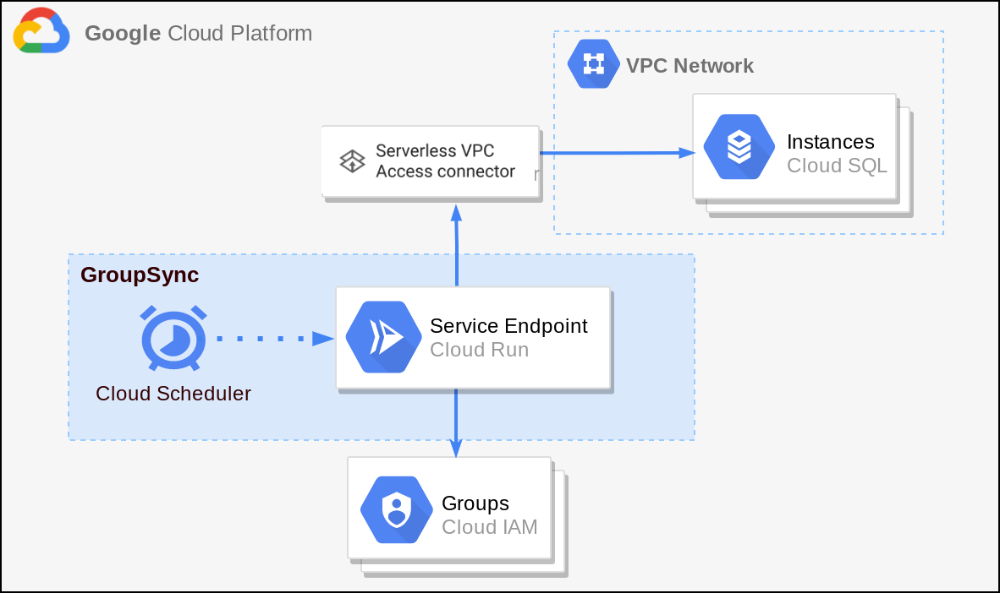

# Cloud SQL IAM Database Authentication for Groups
**Note:** This is not an officially supported Google product.

A self-deployed service that provides support for managing [Cloud SQL IAM Database Authentication](https://cloud.google.com/sql/docs/mysql/authentication) for groups. This service leverages [Cloud Run](https://cloud.google.com/run), [Cloud Scheduler](https://cloud.google.com/scheduler), and the [Cloud SQL Python Connector](https://github.com/googlecloudplatform/cloud-sql-python-connector) to consistently update and sync Cloud SQL instances based on IAM groups. It can create missing database IAM users, GRANT roles to database IAM users based on their IAM groups, and REVOKE roles from database IAM users no longer in IAM groups.

## Supported Databases
Currently only **MySQL 8.0** databases are supported.

## Overview of Service
The Cloud SQL IAM Database Authentication for Groups service at an overview is made of Cloud Scheduler Job(s) and Cloud Run instance(s). 

The Cloud Scheduler Job(s) are configured to run on the interval of your choosing (every 10 mins, 1 hour, daily etc.) When ran, the Cloud Scheduler calls the IAM Database Authentication for Groups Cloud Run service, passing in the configured request body from the scheduler, which contains parameters that tell the service which IAM groups and which Cloud SQL instances to sync and manage. 

<p align="center"></p>

The Cloud Run service calls the required Google APIs to get a snapshot of the current IAM group(s) members and the current Cloud SQL instance(s) database users, it then adds any new IAM members who have been added to the IAM group since the last sync as an IAM database user on the corresponding Cloud SQL instances. The Cloud Run service then also verifies or creates a database role within each configured database for each configured IAM group. Mapping each IAM group to a database role, the service can then GRANT/REVOKE this group role with the appropriate database permissions for the IAM group to all the proper IAM database users who are missing it or should not have it based on the members of the IAM group.

<p align="center"></p>

## Initial Setup for Service
There are a few initial setups steps to get the service ready and grant it the permissions needed in order to successfully operate. However, after this setup is complete, minimal configuration is needed in the future.

### Installation
To run this service successfully, please clone this repository to an environment that thas the Google Cloud SDK installed and initialized. [(Install and initialize the Cloud SDK)](https://cloud.google.com/sdk/docs/install)

```
git clone https://github.com/GoogleCloudPlatform/cloud-sql-iam-db-authn-groups
```
 
Step into the code directory.

```
cd cloud-sql-iam-db-authn-groups
```

Make sure the desired Google Cloud project is set. ([Creating a project](https://cloud.google.com/resource-manager/docs/creating-managing-projects))

```
gcloud config set project PROJECT_ID
```

Replace the following values:
- `PROJECT_ID`: The Google Cloud project ID.

### Enable APIs
This service requires enabling the following Cloud APIs for a successful deployment and lifecycle.
 - [Cloud Run API](https://console.cloud.google.com/apis/api/run.googleapis.com/overview)
 - [Cloud Scheduler API](https://console.cloud.google.com/apis/api/cloudscheduler.googleapis.com/overview)
 - [Cloud Build API](https://console.cloud.google.com/apis/api/cloudbuild.googleapis.com/overview)
 - [Cloud SQL Admin API](https://console.cloud.google.com/apis/api/sqladmin.googleapis.com/overview)
 - [Admin SDK API](https://console.cloud.google.com/apis/api/admin.googleapis.com/overview)
 - [IAM Service Account Credentials API](https://console.cloud.google.com/apis/api/iamcredentials.googleapis.com/overview)

 **Note:** If planning to use service with a Cloud SQL instance that has a Private IP, the following additional APIs need to be enabled. 
 - [Serverless VPC Access API](https://console.cloud.google.com/apis/api/vpcaccess.googleapis.com)
 - [Service Networking API](https://console.cloud.google.com/apis/api/servicenetworking.googleapis.com/overview)

 The above APIs and Services can be manually enabled through [APIs and Services](https://console.cloud.google.com/apis/dashboard) in the cloud console or enabled all at once by running one of the below commands.

 Enable APIs for use during the service:

 ```
 gcloud services enable run.googleapis.com cloudscheduler.googleapis.com cloudbuild.googleapis.com sqladmin.googleapis.com admin.googleapis.com iamcredentials.googleapis.com
 ```

 Enable additional APIs if service needs connections to **Private IP** Cloud SQL instances:

 ```
 gcloud services enable vpcaccess.googleapis.com servicenetworking.googleapis.com
 ```

 ### Service Account
A service account must be created and granted the proper IAM roles in order for the service to have appropriate credentials and permissions to access APIs, IAM groups and database users.

The following commands will create a service account and grant it the proper IAM roles for the service to run successfully.

```
gcloud iam service-accounts create SERVICE_ACCOUNT_ID \
    --description="IAM Groups Authn Service Account" \
    --display-name="IAM Database Groups Authentication"
```
Replace the following values:
- `SERVICE_ACCOUNT_ID`: The ID (name) for the service account.

Grant new service account the following IAM roles.

```
gcloud projects add-iam-policy-binding PROJECT_ID \
    --member="serviceAccount:SERVICE_ACCOUNT_ID@PROJECT_ID.iam.gserviceaccount.com" \
    --role="roles/cloudsql.admin"
```

```
gcloud projects add-iam-policy-binding PROJECT_ID \
    --member="serviceAccount:SERVICE_ACCOUNT_ID@PROJECT_ID.iam.gserviceaccount.com" \
    --role="roles/iam.serviceAccountTokenCreator"
```

```
gcloud projects add-iam-policy-binding PROJECT_ID \
    --member="serviceAccount:SERVICE_ACCOUNT_ID@PROJECT_ID.iam.gserviceaccount.com" \
    --role="roles/run.invoker"
```
Replace the following values:
- `SERVICE_ACCOUNT_ID`: The ID (name) for the service account.
- `PROJECT_ID`: The Google Cloud project ID.

### Domain Wide Delegation
To properly allow read-access of an organization's IAM group members (i.e. which IAM users belong within a specific IAM group) within the service, we need to enable [Domain-Wide Delegation](https://developers.google.com/admin-sdk/directory/v1/guides/delegation) for the service account created above. This will allow the service account to properly call the [List Members Discovery API](https://developers.google.com/admin-sdk/directory/reference/rest/v1/members/list) to keep track of the IAM members being managed through this service. Enable Domain-Wide Delegation for the [service account](https://console.developers.google.com/iam-admin/serviceaccounts) created above by following the steps found here, [Enable Domain-Wide Delegation for Service Account](https://developers.google.com/admin-sdk/directory/v1/guides/delegation) starting at "**To enable Google Workspace domain-wide delegation...**" and continue until "**Step 6: Authorize**".

When prompted for OAuth Scopes, give the following scope, **`https://www.googleapis.com/auth/admin.directory.group.member.readonly`** to allow strictly read-only access of IAM group members.

**Note:** An Admin user will be needed for enabling Domain-Wide Delegation for the service account. **Keep track of the email address** for the admin user who granted the access, it will be needed during a configuration step later on.

### Cloud SQL Instances
This service requires Cloud SQL instances to be already created and to have the `cloudsql_iam_authentication` flag turned **On**. [(How to enable flag)](https://cloud.google.com/sql/docs/mysql/create-edit-iam-instances)

#### IAM Group to Database Role Mapping
The Cloud Run service maps the permissions that each IAM group and its IAM members should have on each Cloud SQL instance through a [database role](https://dev.mysql.com/doc/refman/8.0/en/roles.html). This database role is then granted to the proper database users that belong to the IAM group, giving them the appropriate database privileges on the Cloud SQL database instances for the IAM group.

Each IAM group that is being managed through the service will need a corresponding database role on each Cloud SQL instance configured to properly grant permissions to IAM database users. 

The name of the IAM group database role **MUST BE** the email of the IAM group without everything after and including the **@** sign of the IAM group email. 
(Ex. IAM group with email "example-group@test.com", would have a database role "example-group" on each Cloud SQL instance it is configured with.)

The Cloud Run service verifies that a group role exists or creates one on the database if it does not exist. It is recommended that a Database Administrator or project admin create the group roles on each Cloud SQL instance and GRANT the group roles the appropriate privileges to be inherited by database users of those IAM groups prior to running the service. This will allow a more smooth service, because if the Cloud Run service is required to create the group roles, it will create them without the proper privileges (blank roles) and in doing so any IAM database users granted the group role will also not get the proper privileges.

**NOTE:** It is up to a Database Administrator or project admin to configure the proper privileges on each group role. The Cloud Run service will then be able to grant or revoke each group role with privileges to the proper database users.

#### IAM Service Account Instance User
To properly manage the database users on each Cloud SQL instance that is configured with the service, the service needs to GRANT/REVOKE database users the proper role(s) corresponding to their IAM group(s). This is achieved by creating an IAM database authenticated service account user on each instance using the service account previously created. This will allow the service account to authenticate to the instance(s) during the Cloud Run service through the [Cloud SQL Python Connector](https://github.com/GoogleCloudPlatform/cloud-sql-python-connector).

Add the service account as an IAM authenticated database user on each Cloud SQL instance that needs managing through IAM groups. Can be done both manually through the Google Cloud Console or through the following `gcloud` command.

```
gcloud sql users create SERVICE_ACCOUNT_EMAIL \
--instance=INSTANCE_NAME \
--type=cloud_iam_service_account
```
Replace the following values:
- `SERVICE_ACCOUNT_EMAIL`: The email address for the service account.
- `INSTANCE_NAME`: The name of a Cloud SQL instance.

#### Granting Database Permissions to IAM Service Account Instance User
For the service to run smoothly it needs the IAM service account database user to be granted several permissions on all Cloud SQL instances that the user was added to above. This allows for the service to read usernames of other database users and GRANT/REVOKE the group role(s) appropriately.

Connect to all Cloud SQL instances in question with the **root** user or as another user with appropriate permissions for the following commands. 

Connecting to a Cloud SQL instance can be done many different ways. ([Cloud Shell](https://cloud.google.com/sql/docs/mysql/quickstart#connect), [Cloud SQL Connector](https://cloud.google.com/sql/docs/mysql/connect-connectors#python), [Cloud SQL Auth Proxy](https://cloud.google.com/sql/docs/mysql/quickstart-proxy-test#install-proxy), [Private IP Proxy](https://cloud.google.com/sql/docs/mysql/quickstart-private-ip), etc)

 Below is an example `gcloud` command to connect to a Cloud SQL instance as `root` user through [Cloud Shell](https://cloud.google.com/sql/docs/mysql/quickstart#connect).

 ```
 gcloud sql connect INSTANCE_NAME --user=root
 ```
 Replace the following values:
- `INSTANCE_NAME`: The name of a Cloud SQL instance.

Enter password for `root` user when prompted.

Once connected, grant the service account IAM database user the following permissions:

Allow the service account to read database users and their roles.
```
GRANT SELECT ON mysql.role_edges TO 'SERVICE_ACCOUNT_ID';I
```

Allow the service account to **CREATE** group roles for IAM groups if they are missing.
```
GRANT CREATE ROLE ON *.* TO 'SERVICE_ACCOUNT_ID';
```

Allow the service account to **GRANT/REVOKE** roles to users through being a **ROLE_ADMIN**.
```
GRANT ROLE_ADMIN ON *.* TO 'SERVICE_ACCOUNT_ID';
```
Replace the following values in the above commands:
- `SERVICE_ACCOUNT_ID`: The ID (name) for the service account (everything before the **@** portion of email)
## Deploying Cloud Run Service
To build and deploy the service using Cloud Run, run the following commands.

Build the container image for the service using Cloud Build:

```
gcloud builds submit \
  --tag gcr.io/PROJECT_ID/iam-db-authn-groups \
  --project PROJECT_ID
```
Replace the following values:
- `PROJECT_ID`: The Google Cloud project ID.

Deploy Cloud Run Service from container image:

```
gcloud run deploy iam-db-authn-groups \
  --image gcr.io/PROJECT_ID/iam-db-authn-groups \
  --no-allow-unauthenticated \
  --service-account SERVICE_ACCOUNT_EMAIL \
  --project PROJECT_ID
```

Replace the following values:
- `SERVICE_ACCOUNT_EMAIL`: The email address for the service account.
- `PROJECT_ID`: The Google Cloud project ID.

You should now successfully have a Cloud Run service deployed under the name `iam-db-authn-groups`. The service URL should be outputted from the `gcloud` command above but can also be found in the [Cloud Console](https://console.cloud.google.com/run).

## Configuring Cloud Scheduler
Cloud Scheduler can be used to invoke the Cloud Run service on a timely interval and constantly sync the Cloud SQL instance database users and appropriate database permissions with the given IAM groups. Cloud Scheduler is used to manage and configure multiple mappings between different **Cloud SQL Instances** and **IAM groups** while only needing a single Cloud Run service (for public IP connections).

An example command creating a Cloud Scheduler job to run the IAM database authentication service for IAM groups and Cloud SQL instances can be seen below.

```
gcloud scheduler jobs create http \
    JOB_NAME \
    --schedule="*/10 * * * *" \
    --uri="SERVICE_URL/run" \
    --oidc-service-account-email SERVICE_ACCOUNT_EMAIL \
    --http-method=PUT \
    --headers="Content-Type: application/json" \
    --message-body="{"iam-groups": ["group@test.com", "group2@test.com"], "sql_instances": ["project:region:instance", "project:region:instance2], "admin_email": "user@test.com", "private_ip": false}"

```
Replace the following values:
- `JOB_NAME`: The name for the Cloud Scheduler job.
- `SERVICE_URL`: The service URL of the Cloud Run service.
- `SERVICE_ACCOUNT_EMAIL`: The email address for the service account.
- `PROJECT_ID`: The Google Cloud project ID.
- The values for `iam-groups`, `sql_instances`, `admin_email`, and `private_ip`(optional param) within `--message-body`.

The `--schedule` flag is what controls how often the Cloud Scheduler job will trigger the Cloud Run service endpoint. It is currently defaulted to `*/10 * * * *` which will cause it to trigger every 10 minutes. See [Configuring Cron Job Schedules](https://cloud.google.com/scheduler/docs/configuring/cron-job-schedules) on how to format the schedule for different time intervals or [Cron Guru](https://crontab.guru/) to play around with schedule formats.

The body for the POST request to the Cloud Run service can also be configured for Cloud Scheduler through a JSON file by switching out the `--message-body` flag for the flag `--message-body-from-file` where the value is set to the file path of a JSON file with the proper params.

An example JSON config file would look like the following.

```
{
    "iam_groups": ["group@test.com, "group2@test.com],
    "sql_instances": ["project:region:instance"],
    "admin_email": "admin_user@test.com,
    "private_ip": false
}
```

Where:
- **sql_instances**: List of all Cloud SQL instances to configure.
- **iam_groups**: List of all IAM Groups to manage DB users of.
- **admin_email**: Email of user with proper admin privileges for Google Workspace, needed
    for calling Directory API to fetch IAM users within IAM groups. **FROM DOMAIN_WIDE DELEGATION SECTION**
- **private_ip** (optional): Boolean flag for private or public IP addresses.

**Note:** These are placeholder values and should be replaced with proper IAM groups, Cloud SQL instance connection names, and admin email address.

To learn more about the different Cloud Scheduler flags, read the [official documentation](https://cloud.google.com/sdk/gcloud/reference/scheduler/jobs/create/http).


## Running Service with Private IP Cloud SQL Connections
This service does work for Private IP database connections however, there are some additional configurations needed and some limitations to mention.

To run this service with Private IP, first make sure all Cloud SQL instances that are going to be connected to have a Private IP address configured. ([Configure Private IP for Cloud SQL](https://cloud.google.com/sql/docs/mysql/configure-private-ip))

Private IP Cloud SQL instance(s) should be connected to a [VPC Network](https://cloud.google.com/vpc/docs/using-vpc) which can be accessed securely via Cloud Run using [Serverless VPC Access](https://console.cloud.google.com/networking/connectors) which creates a VPC Connector.

Thie VPC Connector can be attached to the Cloud Run service previously created to allow Private IP connections to the Cloud SQL instances on the **same VPC Network**.

Update the Cloud Run service with a VPC Connector:
```
gcloud run services update iam-db-authn-groups --vpc-connector CONNECTOR_NAME
```
Replace the following values:
- `CONNECTOR_NAME`: The name for the VPC Connector on the same VPC network as the Cloud SQL instance(s) with Private IP addresses.

**NOTE:** Private IP connections require that the Cloud SQL instance and the Cloud Run service be connected to the same VPC Network to work correctly.

## Custom Configurations
Multiple different Cloud Scheduler and Cloud Run configurations can be configured depending on the Cloud SQL instance to IAM Group mappings required along with the IP address types being used to connect to instances. 

A Cloud Scheduler job maps which IAM group(s) and hence which IAM users to manage permissions for any given Cloud SQL instance(s). When configuring a Cloud Scheduler job, all IAM groups listed in the JSON body will be mapped to all Cloud SQL instances in the JSON body. Therefore, for custom configurations where certain IAM groups need to be mapped to one instance, and other IAM groups to a different Cloud SQL instance, the solution is to deploy multiple Cloud Scheduler jobs.

<p align="center"></p>

A single Cloud Run service can be used for multiple Cloud Scheduler jobs across an organization's different Google Cloud projects as long as they allow Public IP connections.

### Private IP Configurations
**NOTE:** For custom configurations with Private IP connections, multiple Cloud Run services may be required. Since Private IP configurations require the Cloud Run service and Cloud SQL instances to be connected to the same VPC network, thus for different projects with different VPC networks, a different Cloud Run service will be needed for each.

<p align="center"></p>
